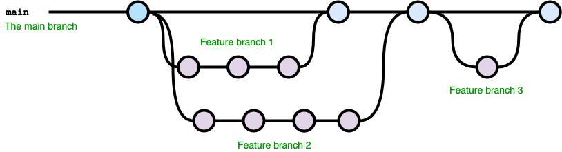

# Git & Github

## DOC

[git-cheat-sheet-education](https://drive.google.com/file/d/117NcTrgxAqvMHj49MFoEWcHs2mlUg5DX/view?usp=drive_link)

[OPEN DOC](https://docs.google.com/document/d/1ELQUPHZVlOkczI4yI2p_uJD5po9nPI-NFIRUnzzEa3k/edit?usp=sharing)

## CLASS RECORDING

1. [Introduction-installation-git github basic](https://youtu.be/JRcb5karOtk)

2. [Git-Github practice class](https://youtu.be/zCMpKMOwQ5Q)


## Configure git
- open your terminal and add below command.

```js
Set your username:

 git config --global user.name "Robert Welker"

Set your email address:

git config --global user.email "robert123@gmail.com"

Now u can check the status of you usename and email

git config --list

```


```javascript

git add .
git commit -m "change 1"

git log 

git reset . - this is just opposite of add . take out of the staging area 

git push

git checkout -b feature_branch

git checkout [version id to go any previous version]

```


## Let's create project now and practice the git command

- create new folder
- switch to new folder
- git init ( initialize the folder for git repository)
- create some file, script.js, index.html, style.css add some code

## commands to add

- (git add) filename
  or
- (git add .) // adds all the changes
- (git status) // to check the status
- (git commit -m "initial commit") to commit the change to git resporistary. add the resonable message about the file and changes

- (git log) // to check how may commit done previously

- to create branch
- (git branch feature)

- To switch to branch
- (git checkout feature)

or

- you can use single command to crete branch and switch to the branch

  - (git checkout -b feature2)

- git add .
- git commit -m "update"
- git push
  or
- git push --set-upstream origin feature2

- switch to parent branch and use below command to merge the feature branch

- (git merge feature2)

## how to create branch and switch to different branch

- git branch // first u will see the master branch if there is no any branch crearted previoulsy.
- git log

- git checkout -b feature-branch // create new feature-branch and switch to the new branch

create different feature branches as you progress in your project. commit regularly.



# Create Accout in Github

[Github Link](https://github.com/)

**What is GitHub and why it is used?**
GitHub is a code hosting platform for version control and collaboration. It lets you and others work together on projects from anywhere. This tutorial teaches you GitHub essentials like repositories, branches, commits, and pull requests.

# Generating SSh key

[Document](https://docs.github.com/en/authentication/connecting-to-github-with-ssh/adding-a-new-ssh-key-to-your-github-account?tool=webui)

### command to generate SSH key

- open your Window PoweSheel as administrator
- use your github email id

- ssh-keygen -t ed25519 -C "your_email@example.com"

**add your SSH private key to the ssh-agent**

- ssh-add ~/.ssh/id_ed25519

**copy the SSH key**

- cat ~/.ssh/id_ed25519.pub | clip

**go to github setting SSH and GPG keys**

- Click new SSH key
- give title
- paste the key in box
- click on add SSH button

# To setup linter

- add eslint and prettier extension to your vscode editor.

## initialize your project folder

npm init -y

install the below package.

```
npm i -D eslint eslint-config-prettier eslint-plugin-prettier prettier

```

now create .eslintrc file in root directory and add below code.

```
{
  "extends": [
    "plugin:prettier/recommended"
  ],

  "plugins": ["prettier"],

  "rules": {
    "prettier/prettier": "error"
  }
}

```

now create .prettierrc file in root directory and add below code.

```
{
  "semi": true,
  "singleQuote": true,
  "tabWidth": 2,
  "useTabs": false
}
```

As the final step, you need to enable formatOnSave in VSCode. You can add the following line to the settings.json file for that:

```
"editor.formatOnSave": true,

```

[Integrating Prettier and ESLint With VS Code](https://enlear.academy/integrating-prettier-and-eslint-with-vs-code-1d2f6fb53bc9)

# linters-config

[linters-config](https://github.com/microverseinc/linters-config)


# Class - Day-2

## Follow this steps to master git.

### Introduction to Git

Git is a version control system that helps developers keep track of changes in their code. Imagine working on a group project where everyone makes changes to the same document. It can quickly become confusing to manage who changed what and when. Git solves this problem by providing a structured way to manage changes and collaborate.

Key Concepts
### Repository (Repo):

A repository is like a project's folder. It contains all the project files and the history of every change made to those files.

### Commit:

A commit is like saving a snapshot of your project. Every time you reach a point where you want to save your work (because it works or you've made significant progress), you make a commit. Each commit has a unique ID and a message describing what changes were made.

### Branch:

A branch is a separate line of development. Imagine you want to try a new feature without affecting the main project. You create a branch, make your changes, and if everything works out, you can merge the branch back into the main line.

### Merge:

Merging is the process of combining changes from one branch into another. For example, once your new feature is ready, you merge it into the main branch so everyone else can use it.

### Remote Repository:

A remote repository is like a backup of your repository stored on the internet. Platforms like GitHub, GitLab, and Bitbucket host remote repositories, allowing you to collaborate with others. You can push (upload) your changes to the remote repo and pull (download) changes from others.

### Basic Git Commands

`git init`

Initializes a new Git repository in your current directory.

`git clone [url]`

Creates a copy of an existing remote repository on your local machine.

`git add [file]`

Stages a file, marking it for inclusion in the next commit.

`git commit -m "message"`

Commits the staged changes with a descriptive message.
`git status`

Shows the status of changes as untracked, modified, or staged.
git log:

Displays the commit history.

`git branch [branch-name]`

Creates a new branch.

`git checkout [branch-name]`

Switches to the specified branch.

`git merge [branch-name]`

Merges the specified branch into the current branch.

`git push [remote] [branch]`

Uploads your changes to a remote repository.

`git pull`

Fetches and merges changes from a remote repository to your local branch.
Practical Example

Imagine you are working on a website with your team. Here’s how Git might be used:

Setting Up:

Each team member clones the remote repository to their local machine.

Working on Features:

Sarah creates a new branch new-feature to work on a new section of the website.
She makes changes and commits them with clear messages like git commit -m "Added new section to homepage".

Collaborating:

Once Sarah is happy with her changes, she pushes her branch to the remote repository using git push origin new-feature.

The team reviews the changes and merges the new-feature branch into the main branch after confirming everything works.

Keeping Up to Date:

Team members regularly pull updates from the remote repository to ensure they have the latest version of the project.

Benefits of Using Git

History: You have a record of all changes made to the project, who made them, and why.
Collaboration: Multiple people can work on the project simultaneously without interfering with each other’s work.

Backup: The remote repository serves as a backup of your work.

Experimentation: Branching allows you to experiment with new features safely.

Hands-On Activity

To make this explanation interactive, set up a simple project and implement the following steps:

Initialize a new Git repository.
Create and switch to a new branch.
Make some changes and commit them.
Merge the branch back into the main branch.
Push the changes to a remote repository.
